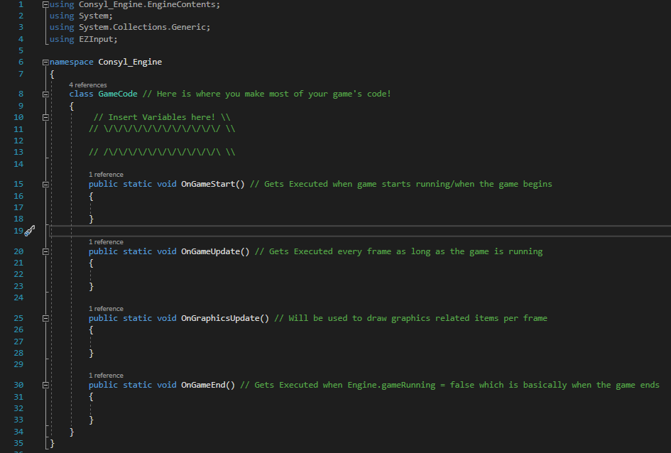
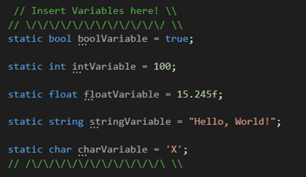
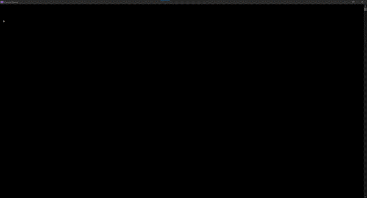
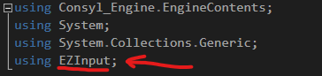

# Consyl-Engine

This is an ASCII Console Game Engine! Go to [Releases](https://github.com/AAli107/Consyl-Engine/releases) and select the latest release to download. Once the download finishes, extract the zip file then read the documentation below if you're new to the game engine.


# Documentation


## Requirements

### Recommended Hardware Requirements

1. CPU: Processor with 2 GHz dual core

2. Memory: 2 GB of DDR3 RAM

3. GPU: Not needed (pc at least needs graphics display on screen)

4. Storage: Consyl takes up around 7 MB of storage, so you don’t need to worry about it

   

### Recommended Software Requirements

1. Windows 10 Operating System

2. Microsoft Visual Studio that can run C# .NET Core 3.1 [(You can download it here)](https://visualstudio.microsoft.com/vs/community/)

   

### Recommended User Knowledge

1. Basic C# code knowledge [(You can watch Brackeys' C# Basics Tutorial Series to get you caught up)](https://www.youtube.com/playlist?list=PLPV2KyIb3jR4CtEelGPsmPzlvP7ISPYzR)
2. Basic Math Knowledge
3. Experience with playing Games (not necessary but recommended)


**Note:** You shouldn’t worry too much on the requirements since most of the requirements like hardware and software you already achieved.


## Game Code Basics

### Navigating to the Main Scripting File

To code your first game, you need to open “Consyl Engine.sln” and from the Solution Explorer, choose “GameCode.cs” which is the part where you put all of your code in for your game. (“Image A” shows how the code is supposed to look like)



**Image A:** This image shows the place where you code your game.


### A Look Around Inside the File

“GameCode.cs” contains the basics of what you need in making your games. It has two important sections, one where you put your variables and data, and the other is where your code gets executed.

The Section where your code is executed has three main parts, “OnGameStart”, “OnGameUpdate”, and “OnGameEnd”.

#### OnGameStart

Is a place where the code you inserted gets executed when the game starts.

#### OnGameUpdate

Is a place where the code you inserted gets executed repeatedly only when the game is running.

#### OnGraphicsUpdate

It’s the same as “OnGameUpdate” but it’s for Graphics.

#### OnGameEnd

Is a place where the code you inserted there gets executed when the game closes through code.


### **What are Variables?**

Variables are pieces of information gets created when the program runs, it is stored inside your computer until you decide to close your program/game. Variables can be manipulated and read by the code to do many fancy instructions.

#### The Main Relevant Types of Variables

**Boolean:** A variable coded in as “bool” that can store either a true or false value.

**Integer:** A variable coded in as “int” that can store non-decimal numbers.

**Floating-point number:** A variable coded in as “float” that store numbers with decimals.

**String:** A variable coded as “string” that can store text.

**Character:** A variable coded as “char” which stores a single letter/symbol

#### How to Code in Variables?

To add in your variable, you need to type in “static” then you type in the variable type, then the variable name and equal sign then the value/data. Here are some examples of variables in the image shown below:



**Image B:** Shows examples of different types of variables.


#### Important notes about variables

It is important to make your variable names easy to read and understand, so you format them like by making the first letter to be lower case and if the name has multiple words, the beginning of every word other than the first one will be upper case. Do not add space between the variable name as it would cause errors. Also, you don’t need to add a value/data inside the variable when you make it, you can just make it without values.


### **An ASCII Pixel**

When you press “F5” key you’ll start to load the game, and it’ll open a window on screen with nothing but black screen in it. We’ll start from the very basic level of drawing an image on screen by drawing a single “ASCII” pixel. “ASCII” is a format of displaying letters/symbols on a computer, but in Consyl Engine we don’t have true pixels, but we do have something named an “ASCII Pixel” which is a pixel made of an ASCII Symbol, which is not a real pixel but will resemble one. 

#### **Drawing an ASCII Pixel on screen**

To Draw an ASCII Pixel, you’ll need to write down in between the curly brackets below “OnGraphicsUpdate” function “gfx.DrawPixel();”. Right now, it will not draw anything, and it will display an error, because you need to tell it where on the screen you want the pixel to appear and how it looks like. For example, you want your pixel to be placed at a coordinate of x = 1 and y = 5 and the ASCII pixel you want to draw looks like this “O”. So, you want instead to type `gfx.DrawPixel(1, 5, ‘O’);`, and when you run your code, you’ll see the output as shown in Image C. You can add more pixels by creating a new line with the same code with different coordinates and ASCII symbol. (Make sure when running your game, you maximize your window to show your result properly)



**Image C:** This Image shows what happens if you code in `gfx.DrawPixel(1, 5, ‘O’);`


## Player input

**Before adding player Input**

All the way at the top of the “GameCode.cs” script, you’ll see `using` codes which gives access to more code for the developer to use. “Image D” shows how section displaying `using EZInput;` looks like. If you don’t have that for whatever reason, type it down since you will need this to allow for user input.



**Image D:** Shows EZInput

<br>


#### How to Add Player Input?

You need to type in, inside the OnGameUpdate function an if statement, which is used to check for bools and functions. To make an if statement, you need to type `if()` and open and close curly brackets like this:

```c#
If ()
{
    // Code here
}
```

Right now, there is no logic. So, you need to add between the parenthesis next to `if` your logic, if the logic is true, then execute the code between the curly brackets. So, we do this:

```c#
if (Keyboard.IsKeyPressed(Key.A))
{
    // Code here
}
```

This will check if you have pressed the A key. if you did the code will execute. If you add the `DrawPixel()` code from before inside the curly brackets, this will result when you run it to make the pixel only appear when you press A. Note that you can change `Key.A` to any key on the keyboard, like `Key.B`, `Key.Shift`, etc.


#### **Creating a Controllable Player**

Before, we drew a pixel on the screen and made it only show when you press “A” key. Now remove all of that and let’s make a way to make a controllable player as a pixel.

First, you need to create 3 variables, one that stores the x coordinate, one that stores the y coordinate and one that stores the speed of the player. Image E will show you how this is done.


**Image E:** Shows the required variables for controlling the player.

Then in OnGraphicsUpdate() Function you type this between the curly brackets:

`gfx.DrawPixel((int)playerX, (int)playerY, ‘O’);`

Note that `(int)` is a way to convert from float to integer. This piece of code will draw the image at whatever the playerX and playerY was at. You can set the values to whatever you like, which would change where the player is on the screen.

 <br>

**Image F:** Shows the how code looks like. (`gfx.DrawPixel()` function is in OnGameUpdate() so that the image would fit)


## Graphics.cs

As you saw previously, you can draw images using the DrawPixel() code. But there are shortcuts to draw many shapes like circles, rectangles, lines and more.

Drawing Lines can be done by using gfx.DrawLine() function. You add the first point’s x and y coordinates and the second point’s x and y coordinates, then choose the character you want the line’s pixels to look like. For example, we type in this code inside the OnGraphicsUpdate() Function:            `gfx.DrawLine(10, 24, 80, 30, 'X');`

This will draw a line from point (10, 24) and point (80, 30) as exactly shown in Image G.


**Image G:** Shows a single line of ASCII Pixels being drawn on screen.


Every other shape requires coordinates and only this one which requires more than one coordinates. So, just give the proper values that the drawing function and it will draw what it’s supposed to draw on the screen based on the values given.


#### Drawing a Circle

There are two functions to draw a circle, one which draw a circle outline and the other draw a filled circle. Two of those require the same values and numbers, which are the x and y coordinates, the radius and how the ASCII pixels should look like. It should be easy to understand this once you messed around with the functions.


## Textures.cs

Textures are essential to make better looking games and it saves the time of drawing every ASCII pixel one-by-one through placing `gfx.DrawPixel()`. But that’s not what you’re going to do. So, textures are basically the images that gets loaded and placed in your game’s window.

 

#### How to draw a texture?

First you need to create a special class variable, this variable will need the image file name with its format for example “guy.png”. To import an image, go to the folder where the exe of your game is stored and paste your image there. Image H shows how the variable looks like.


**Image H:** Shows how the texture class variable looks like.


Since my texture is 64x64 in resolution I will place the texture at coordinates of (0, 0). To Draw the image, you need to code inside OnGraphicsUpdate() this code: `guyImage.DrawImage(0, 0);`

When you play the game, it will show up something like in Image I or whatever texture you used.


**Image I:** Shows the “guy.png” being drawn on the game’s window. (If you see colors on this image, it's just that the brackets on that image cause an artifact when looking at it through a zoomed out image)

 

Keep in note that textures currently don’t fully support transparency, but it will make the color black the same color as the background. Also, Consyl Engine currently supports the following file formats: **BMP**, **GIF**, **EXIF**, **JPG**, **PNG**, and **TIFF**.


## Audio.cs

Games would seem silent and filled with void without Audio. So, sound is essential to give players feedback. You’re not going to use Console.Beep() which comes with the .NET Core 3.1. There is another special variable like the texture variable which would load the audio file and plays it whenever the programmer likes.

 

#### How to play an audio file?

First, we need to create an audio class, which contains the sound effect file name/path. (Class variable shown in Image J)


**Image J:** Shows how the Audio class variable looks like.


Then, create an if statement that contains the play where you press any letter you like, for example “S”. The game would crash immediately, since it was playing the sound many times each second. So, you need to create a bool variable that will make it play only once. Add the variable to the if statement and set it to false once the audio plays. Image K will show how the code will look like.


**Image K:** Shows how the code was written for playing a sound file when pressing “S” once.


Note that the Audio system only supports **MP3** and **WAV** file types only. The Audio System also supports Stopping, Pausing and unpausing of the audio. All are found in the Audio Class Variable that you created as functions.


## Engine.cs

So far, you’ve been programming all in a single file, the “GameCode.cs” file. But now, you’ll be modifying some values inside the Engine’s code, and learn more on how to make your games better.

 

#### Inside the Engine’s code

Open “Engine.cs”, then you’ll see only 63 lines of code, most of them you would ignore and not mess with, unless if you know what you’re doing. There is a section inside the Engine script file which stores a lot of important variables. The variables are organized into the 3 sections as seen in Image L.


**Image L:** Shows all the user modifiable variables inside “Engine.cs”.


Here is a list of all the variables and what they do:

1. **gameTitle:** Allows the modification of the Game’s title.

2. **gameRunning:** Can be set to false in “GameCode.cs” to close the game.

3. **gamePaused:** If true, it will pause the execution of OnGameUpdate().

4. **drawASCIIRender:** Enables and Disables the ASCII graphics. (If you don’t want to use it)

5. **resolution:** Drawing Resolution for the ASCII Graphics.

6. **framerate:** The maximum framerate the game can run at.

7. **BgColor:** The Background Color of the game. (can only be set through code)

8. **FgColor:** The Color of the texts and characters. (can only be set through code)


These variables can be used to make your games better and most can be controlled in “GameCode.cs” by typing for example,  

`Engine.gameRunning = false;` This will cause the game to quit.

`Engine.gamePaused = true;` This will cause the game to pause by blocking the execution of OnGameUpdate() function.


## Utilities.cs

Utilities.cs contains many useful functions which you would probably use for your Consyl-based Video Games.

 

#### Rand

Rand is a class inside the Utilities class which contain many functions that helps with generating random numbers and values, it contains functions that can randomize floats in between a range of inputted values, same goes with integers. Also, it has a function that randomizes between true or false for code that requires Boolean statements like if statements.

 

#### Vec2D

Vec2D is another class inside the Utilities class which contains some useful functions for 2D vectors.

So far there are two functions, one calculates with two 2D vector points which returns a float as distance.

The other function will get two 2D vector points and calculates the midpoint of those two points.

 

#### Numbers

Numbers is a class under the Utilities class which contains some useful functions for anything related to numbers like floats and integers.

Right now, there are only two functions, one that calculates the average number from a float array you input in.

The other function calculates the distance between two numbers in 1D space. You can use it for calculating how far an object is from another object or ground.